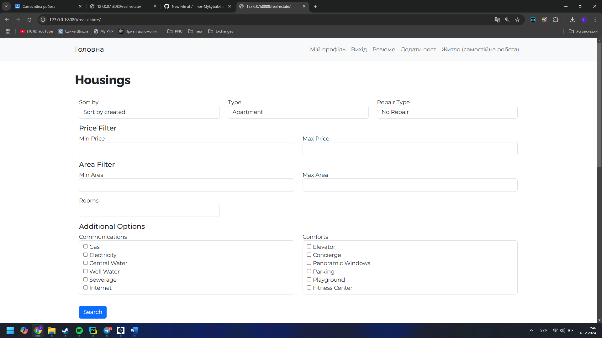
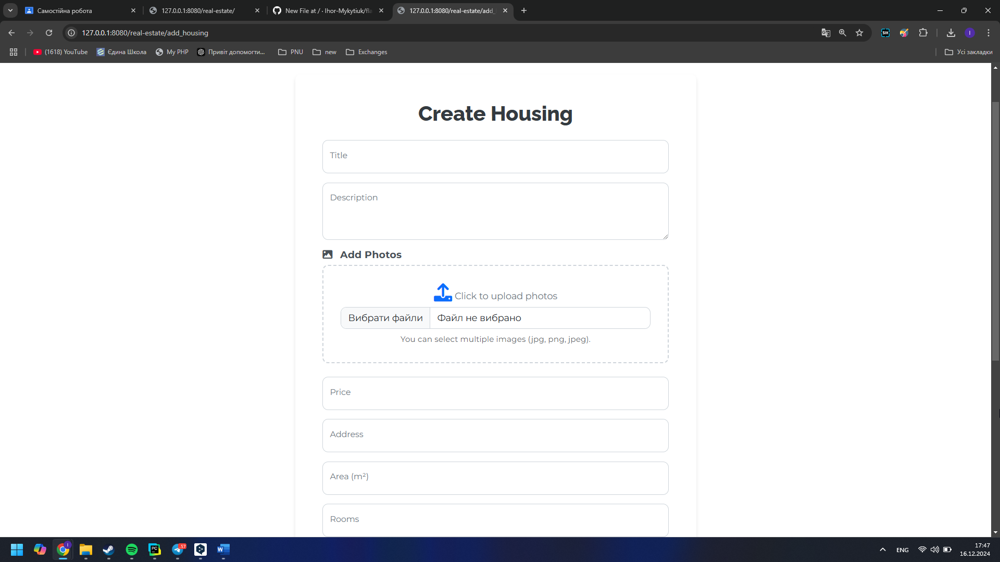
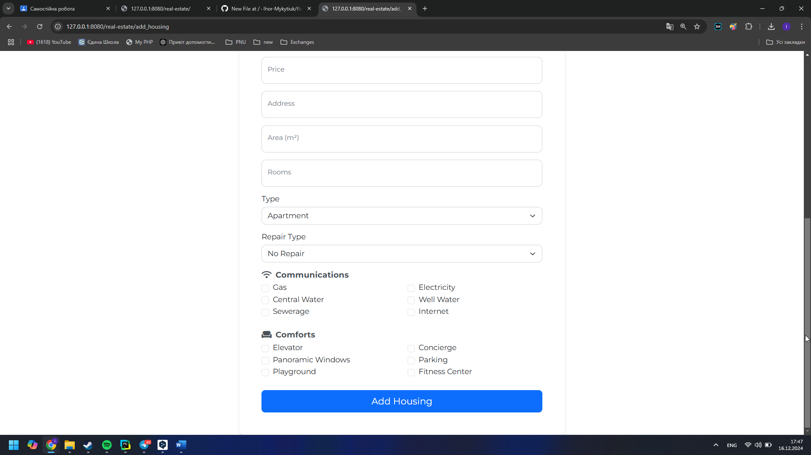
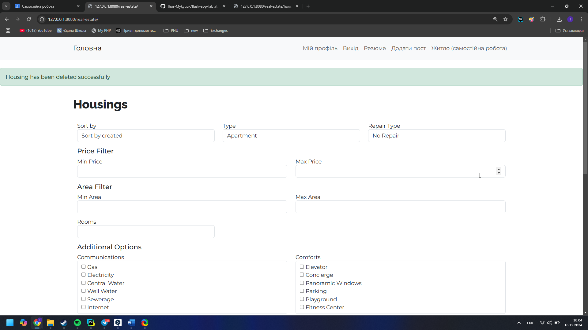

# САМОСТІЙНА РОБОТА «Операції CRUD»

## Опис

**Предметна область**: Житло  
Реалізовано функціонал для **продажу житла** з можливістю створення, читання, оновлення, видалення (**CRUD**) та можливістю **фільтрації** та **сортування** за різними параметрами.

---

## Функціональні можливості

1. **CRUD операції**:
   - **Створення** нового оголошення про продаж житла.
   - **Читання** (перегляд) списку житла.
   - **Оновлення** існуючого оголошення.
   - **Видалення** оголошення.

2. **Фільтрація житла** за наступними параметрами:
   - **Ціна**: мінімальна та максимальна.
   - **Площа**: мінімальна та максимальна.
   - **Кількість кімнат**.
   - **Тип житла**.
   - **Тип ремонту**.
   - **Наявність комунікацій**.
   - **Додаткові зручності (комфорти)**.

3. **Сортування** результатів:
   - За **датою додавання**.
   - За **ціною**.
   - За **кількістю кімнат**.
   - За **площею**.

5. **Повідомлення про результати**:
   - За допомогою `flash` повідомлень користувач отримує інформацію про успішні чи невдалі дії.

6. **Адаптивний інтерфейс**:
   - Застосовано **Bootstrap** для зручного та приємного дизайну.

---

## Приклади роботи

### 1. **Головна сторінка з фільтром пошуку житла**:
Форма для фільтрації за основними параметрами (ціна, площа, кількість кімнат тощо).

---

### 2. **Результати пошуку**:
Відображення оголошень, які відповідають заданим фільтрам.

---

### 3. **CRUD операції**:
- **Створення нового оголошення**:

- **Перегляд наявного оголошення**:

- **Редагування оголошення**:

- **Видалення оголошення**:

